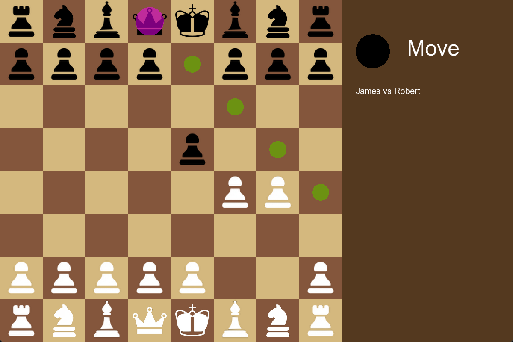
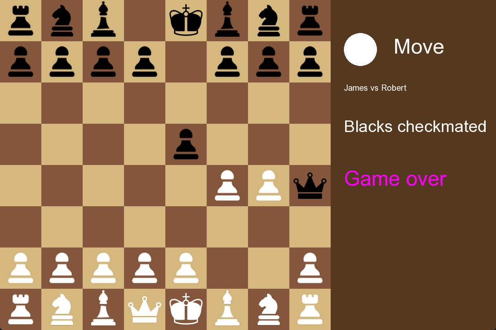
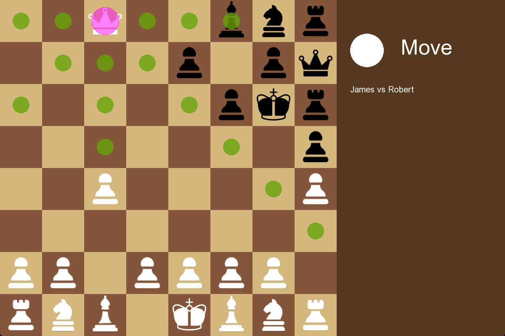
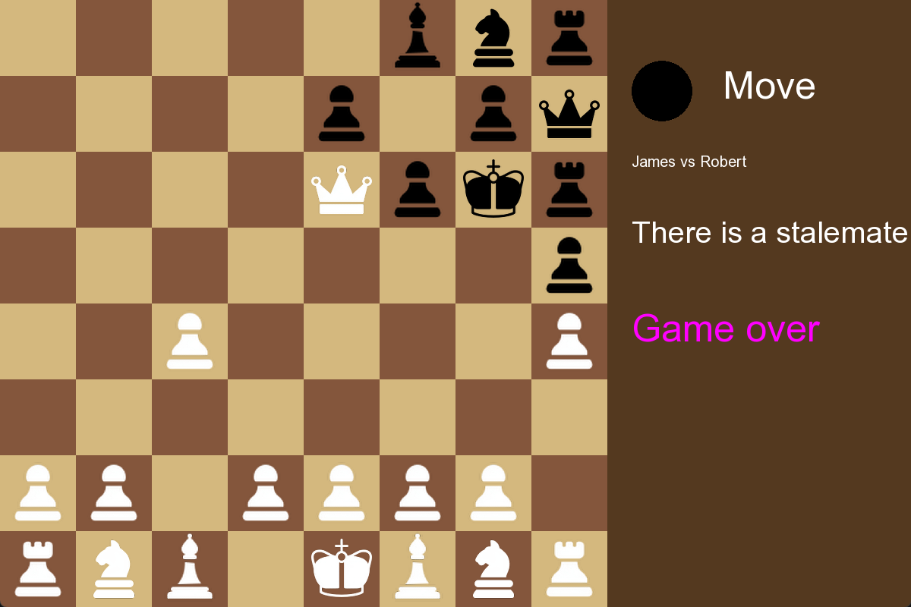

Chess game written on C++ from scratch with UI interface using SFML library.
Main functions are below:

- Checkmate

- Stalemate

Games can be saved and loaded. Examples are in "saved_games" folder.
